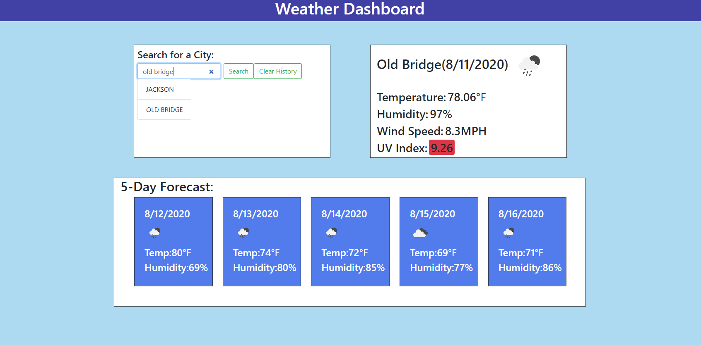

# Weather Dashboard

- This is a weather application that allows the user to search for multiple cities and receive the current and future weather in return. This application will run in the browser with a clean and polished user interface.

---



## File Contents

```
- README.md (this file)

- index.html

- style.css

- script.js

- demo.png

```

---

## Languages Used

```
- HTML/HTML5 is used for structure of information for webpage

- CSS and Bootstrap are used for styling of the website

- Javascript and JQuery are used for powering search function, current weather, and five day forecast

```

---

## Requirements Met

```
- Functional, deployed application to GitHub Pages

- GitHub repository with README describing the project

- Each page has valid and correct, semantic HTML with validation service used

- Presented with current and future conditions for one city at a time when the city is searched for

- City searched for is added to the search history

- Current conditions of city searched includes city name, the date, icon representing weather condition, temperature, humidity, wind speed, and UV index

- UV index indicates whether conditions are favorable, moderate, or severe

- Future weather conditions include date, icon representing weather condition, temperature, and humidity

- City in search history is clickable to view current and future conditions of said city again

- Dashboard displays last searched city forecast when reopened

- Polished UI

- Meets good quality coding standards

- Does not use alerts, confirms, or prompts

```

---
---
